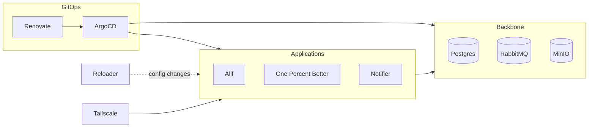

# Cluster (Template)

Defines Kubernetes cluster state and setup scripts for setting a Kubernetes cluster. Uses [copier](https://hgithub.com/copier-org/copier) to create a copy for each environment (i.e. main, sandbox).

## Tech Stack

- ArgoCD for GitOps
- Reloader for reloading deployments on configuration changes
- Sealed Secrets for pushing secrets in Git repository safely
- Renovate for version management for cluster and applications
- Tailscale for exposing applications to personal devices
- Helm for deploying personal applications from [Project Homemade](https://github.com/shazxrin/homerun)
- *(Planned) LGTM stack for monitoring cluster and applications* 
- *(Planned) Vault for secret management* 
- *(Planned) Istio for service mesh* 
- Applications
	- [Alif](https://github.com/shazxrin/alif)
	- *(Planned) [Bloom](https://github.com/shazxrin/bloom)*
	- [One Percent Better](https://github.com/shazxrin/one-percent-better)
	- [Notifier](https://github.com/shazxrin/notifier)
